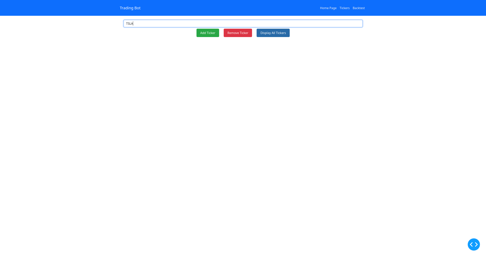
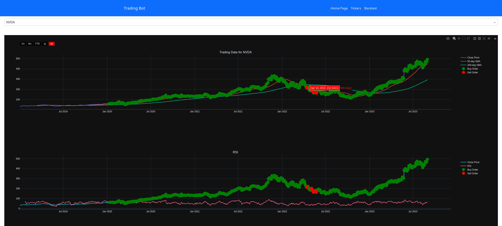
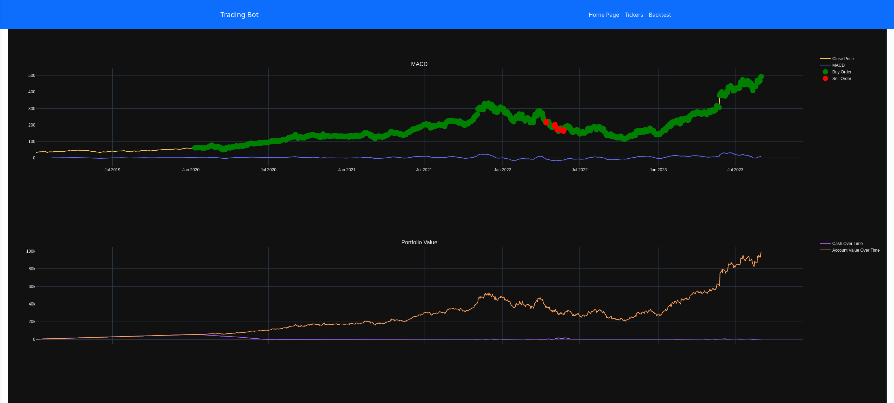
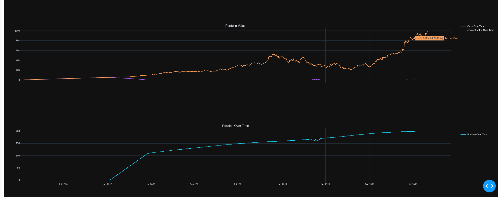
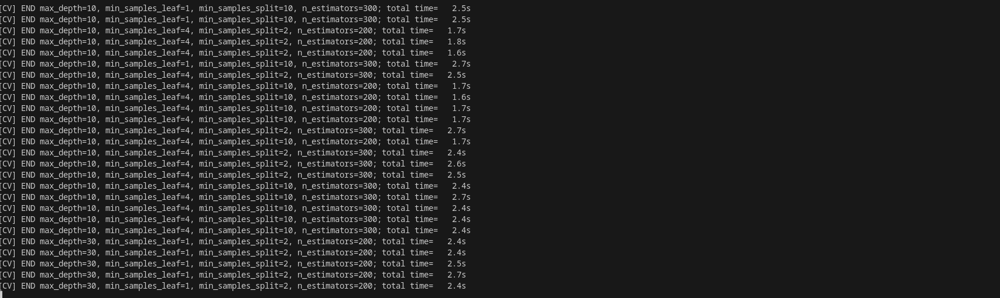
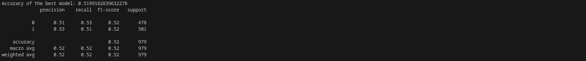

# TradingBot
This is a work in progress project. The time-tested strategies that will be used to design the algorithms behind the trading bot are those that are focused on long-term gains. Using technical analysis and statistics, the bot is intended to generate profits through machine larning predictions rather than manual orders through a brokerage. This would be particularly helpful for those are who can't constantly keep up with market trends and would benefit from investment automation with some customization. The images below represent the current state of the project.

## Tickers Menu

## Trading Data For NVDA

## Command Line 

